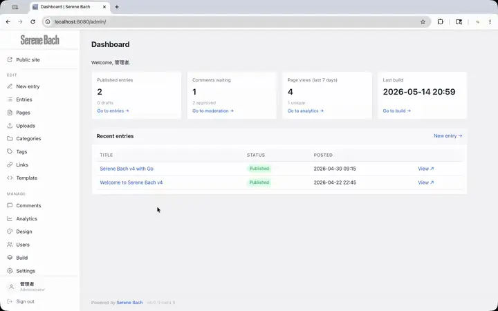

<a href="https://go.serenebach.net/"></a>

[](https://github.com/serendipitynz/serenebach/actions?query=workflow%3ACI)
[](https://goreportcard.com/report/github.com/serendipitynz/serenebach)

---

A self-hostable Go weblog engine — a lighter path between WordPress and Hugo. Small to place, familiar to publish.

[](https://go.serenebach.net/screenshots/admin-tour.mp4)

🌐 **[go.serenebach.net](https://go.serenebach.net)** — features, screenshots, positioning
📄 Japanese: see [README.ja.md](README.ja.md)

## At a glance

- Single statically-linked Go binary, no CGO
- SQLite via [`modernc.org/sqlite`](https://modernc.org/sqlite) (pure Go) — no separate database server
- Runs as a long-lived HTTP server, **or** as a CGI program on traditional shared hosting
- Embedded admin UI, MCP server, and end-user help — nothing extra to deploy
- Static rebuild for hybrid hosting (CDN / static front, dynamic admin behind)
- Templates can reference uploaded JS and web font files alongside images and CSS
- Imports content from legacy Serene Bach v2 (flat-file) and v3 (SQLite) installations, and from a directory of markdown files with YAML front-matter
- Outbound webhooks (entry / comment / image events) for Slack / Discord / Zapier / n8n
- Upload and manage audio, documents, and movies alongside images in the library, with insertion into HTML or Markdown entries
- Auto-generated `sitemap.xml` and `robots.txt` for search-engine discoverability (toggle on/off in site settings)
- Per-entry and per-page SEO metadata: summary (`{entry_excerpt}`, SB3 `sum`-compatible, drives `<meta name="description">` / OG), canonical URL, and a `noindex` toggle that also drops the entry/page from `sitemap.xml`

## Quick start

Requires [Go](https://go.dev/doc/install) and [Task](https://taskfile.dev/installation/).

```bash
task dev    # serves on :8080 (auto-creates the dev DB on first request)
```

Open <http://localhost:8080/> in a browser. The first request to a database without an admin user redirects to **`/setup`**, where you create the administrator account and choose whether to insert a couple of sample entries. After that, the public site lives at `/` and the admin UI at `/admin/login`.

`task dev` also sets `SB_DEV=1`, which disables template and i18n caching so edits to `web/templates/admin/*.html` are reflected on the next request without restarting the server.

Prefer the CLI? `task seed` still works — it creates the dev DB and seeds an admin (`admin` / `changeme` by default; override via `SB_ADMIN_NAME` / `SB_ADMIN_PASSWORD`) without going through the browser flow.

A `.env` template ships at `.env.example`. Copy it to `.env` and fill in `SB_AI_SECRET` if you plan to enable the AI writing assists.

Server-mode HTTP timeouts and graceful shutdown have sensible defaults out of the box and can be tuned via `SB_READ_HEADER_TIMEOUT`, `SB_WRITE_TIMEOUT`, `SB_IDLE_TIMEOUT`, `SB_MAX_HEADER_BYTES`, and `SB_SHUTDOWN_TIMEOUT`. Set `SB_TZ` (e.g. `Asia/Tokyo`) to pin the timezone used for archive month/year boundaries and rendered entry dates so the same binary produces identical output regardless of the host clock. `SB_CSRF_MULTIPART_MAX_BYTES` (raw bytes, default `1048576`) caps how much of a multipart body the CSRF middleware will parse pre-authentication for no-JS fallback forms; JS upload paths send the token via the `X-CSRF-Token` header and bypass the cap entirely. See [docs/configuration.md](docs/configuration.md) for the full list.

Run `serenebach --version` to print the version of the binary you have on disk and exit. The flag works even when the database or environment configuration is missing or broken, so it is safe to use for identifying a freshly unpacked build.

## Docker

```bash
# Build
docker build -t serenebach .

# Run: start the server and open http://localhost:8080/setup to create the admin user
docker run -d -p 8080:8080 -v serenebach-data:/home/nonroot/data serenebach

# Or seed via CLI with an explicit password
docker run --rm -v serenebach-data:/home/nonroot/data -e SB_ADMIN_PASSWORD=<secret> serenebach seed
```

Or use the bundled `docker-compose.yml`:

```bash
docker compose up -d
```

### Pre-built images (GHCR)

Official container images are published to GitHub Container Registry (`ghcr.io/serendipitynz/serenebach`).

```bash
docker pull ghcr.io/serendipitynz/serenebach:latest

docker run -d -p 8080:8080 -v serenebach-data:/home/nonroot/data ghcr.io/serendipitynz/serenebach:latest
```

Available tags:
- `latest` — most recent build on the default branch
- Release tags (`4.0.0-beta.N`, `4.0.0`, …) — see the [GitHub Releases page](https://github.com/serendipitynz/serenebach/releases) for the current version
- `main` — tip of the `main` branch

For production, prefer a pinned release tag over `latest`. See [docs/deployment.md](docs/deployment.md) for QNAP Container Station and VPS deployment examples.

## Quality checks

CI runs the same checks on every push and pull request:

- `task lint` — runs `golangci-lint` against `.golangci.yml` (covers `staticcheck` plus the project lint set, including `gocyclo` at the goreportcard threshold of 15)
- `task test` — runs `go test ./...`

## Companion tools

| Tool | What it does |
|---|---|
| `./bin/serenebach mcp serve` | Start the MCP server over stdio for Claude Code / Cursor / Zed |
| `./bin/serenebach backup` | Create a consistent ZIP snapshot of the database, images, and templates. Optional `--include-analytics` and `--include-public` flags |
| `task build-proxy` | Build the MCP OAuth proxy (`bin/mcp-oauth-proxy`) — bridges ChatGPT's OAuth-only MCP client to Serene Bach's Bearer-token `/mcp` endpoint. See `cmd/mcp-oauth-proxy/README.md` for env vars and ChatGPT configuration. |

## Documentation

| Topic | Link |
|---|---|
| Public + admin URL reference | [docs/url-map.md](docs/url-map.md) |
| Environment variables, flags, `task` shortcuts | [docs/configuration.md](docs/configuration.md) |
| Deployment modes (HTTP server / CGI / static rebuild) | [docs/deployment.md](docs/deployment.md) |
| Migrating from Serene Bach v2 / v3 | [docs/importing-legacy-sb.md](docs/importing-legacy-sb.md) |
| Importing from a directory of markdown files | [docs/importing-markdown.md](docs/importing-markdown.md) |
| Stack overview + design notes (CSRF, anti-spam, OG cards, analytics, …) | [docs/architecture.md](docs/architecture.md) |
| End-user help (also served at `/admin/help` from the running binary) | [docs/help/](docs/help/) |

## License

[MIT](LICENSE). See the file for the full text.
