# Serene Bach 2 から新しい Serene Bach へ引っ越しするガイド

> **これは素案（ドラフト）です。** スクリーンショットは挿入済みです（図1 は本文に埋め込んだ mermaid の流れ図）。各図の撮影仕様・強調箇所・加工の指定は、別紙の [スクリーンショット撮影指示書](sb2-migration-screenshots.md) にまとめています。

このガイドは、レンタルサーバの上で **Serene Bach 2（Perl / CGI 版）** を使っている方が、記事やコメントを新しい **Serene Bach（Go 版・単一プログラム版）** に引っ越しするための手引きです。

専門的な知識がなくても進められるように、ふだん使っている **FTP ソフト** と **ブラウザ** を中心に説明します。パソコン（Windows または macOS）を1台使う前提です。

---

## 目次

1. [このガイドについて](#このガイドについて)
2. [はじめる前に知っておくこと](#はじめる前に知っておくこと)
3. [引っ越しの全体像](#引っ越しの全体像)
4. [ステップ1｜元のブログのデータをダウンロードする](#ステップ1元のブログのデータをダウンロードする)
5. [ステップ2｜新しい Serene Bach を手に入れる](#ステップ2新しい-serene-bach-を手に入れる)
6. [ステップ3｜作業用のフォルダを整える](#ステップ3作業用のフォルダを整える)
7. [ステップ4｜管理者アカウントを作る](#ステップ4管理者アカウントを作る)
8. [ステップ5｜データを取り込む（1回だけのコマンド操作）](#ステップ5データを取り込む1回だけのコマンド操作)
9. [ステップ6｜パソコンの中で結果を確認する](#ステップ6パソコンの中で結果を確認する)
10. [ステップ7｜本番のサーバへ公開する](#ステップ7本番のサーバへ公開する)
11. [移行後のチェックリスト](#移行後のチェックリスト)
12. [困ったときは](#困ったときは)
13. [付録：data フォルダの中のファイルについて](#付録data-フォルダの中のファイルについて)
14. [上級者向けの近道（付録）](#上級者向けの近道付録)

---

## このガイドについて

### 対象の方

- レンタルサーバ（さくらインターネットなど）の上で **Serene Bach 2 を CGI として** 動かしている方
- ふだんは **FTP ソフトとブラウザだけ** で運用していて、コマンド操作にはあまりなじみがない方
- **Windows** または **macOS** のパソコンを使っている方

> 💡 **サーバに SSH でログインできる方・Windows で WSL が使える方** は、もっと手数の少ない方法もあります。[上級者向けの近道（付録）](#上級者向けの近道付録) を参照してください。

### このガイドで到達できること

元のブログの **記事・カテゴリー・コメント・テンプレート・ブログ設定** を新しい Serene Bach に取り込み、パソコンの中で表示を確認したうえで、本番サーバに公開するところまでを一通り行います。

### 所要時間の目安

- データのダウンロードと準備：15〜30分
- 取り込みとパソコンでの確認：15〜30分
- 本番サーバへの公開：サーバの種類によって変わります（[ステップ7](#ステップ7本番のサーバへ公開する)）

### 対象外のこと

- **スマートフォンだけで完結する手順は用意していません。** Serene Bach 2 はスマホが普及する前のソフトで、引っ越し作業ではファイルの取り扱いやコマンド操作が必要になるため、パソコンを1台お使いください。手元にパソコンがない場合は、ご家族や職場のパソコンを一時的にお借りください。
- **トラックバック** は新しい Serene Bach では扱いません（移行もされません）。理由はスパムの温床になりやすく、利点が乏しいためです。

---

## はじめる前に知っておくこと

### ① 1か所だけ「コマンドを打つ」場面があります

新しい Serene Bach は、たくさんのプログラムを組み合わせるのではなく、**1つの実行ファイル**（`serenebach` という小さなプログラム）で動きます。データの取り込みも、この実行ファイルに **1行だけ命令を打つ** ことで行います。

FTP とブラウザしか使ったことがなくても大丈夫です。**コマンドを打つのは全体で1回だけ**で、このガイドではその1行をそのままコピーして貼り付けられるように用意しています（[ステップ5](#ステップ5データを取り込む1回だけのコマンド操作)）。

### ② 元のデータは必ず「コピー」で作業します

引っ越し作業は、必ず **元データのコピー** に対して行ってください。本番サーバ上のファイルを直接いじることはありません。このガイドの手順も、FTP で **ダウンロード（コピー）** したものだけを使います。

### ③ 何が移って、何が移らないか

引っ越しでは、すべてが1対1でそのまま移るわけではありません。先に全体像をつかんでおきましょう。

| データ | 引っ越し | 補足 |
| --- | --- | --- |
| ブログのタイトル・説明・URL 設定 | ✅ 移ります | |
| カテゴリー（親子関係も） | ✅ 移ります | |
| 公開済みの記事（本文・追記・日付・キーワード） | ✅ 移ります | |
| コメント | ✅ 移ります | 投稿者名・本文・日付・IP など |
| テンプレート（デザイン） | ✅ 移ります | ただし **すぐには使われず**、確認後に自分で切り替えます |
| **下書きの記事（未公開のもの）** | ❌ 移りません | 公開済みの記事だけが対象です |
| **画像ファイル** | ❌ 取り込みでは扱いません | 今と同じサーバならそのまま表示されます。別のサーバへ移す場合だけ FTP でコピー（[ステップ7](#ステップ7本番のサーバへ公開する)） |
| **利用者アカウント（ログイン情報）** | ❌ 移りません | パスワードの保存方式が違うため、新しく作り直します |
| **トラックバック** | ❌ 移りません | 新 Serene Bach では非対応 |
| **プラグイン / Amazon 連携 / リンク集** | ❌ 移りません | 必要なものは管理画面で作り直します |

---

## 引っ越しの全体像

作業は次の順番で進みます（**図1**）。

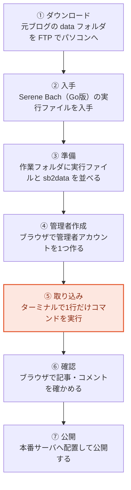

**⑤ の取り込みだけがコマンド操作**で、あとはブラウザと FTP ソフトだけで進められます。

念のため、各ステップを文章でも書いておきます。

1. **ダウンロード** — 元ブログの `data` フォルダを FTP でパソコンに落とす
2. **入手** — 新しい Serene Bach の実行ファイルをダウンロードする
3. **準備** — 作業用フォルダに、実行ファイルとデータを並べる
4. **管理者作成** — ブラウザで管理者アカウントを1つ作る
5. **取り込み** — コマンドを1行打って、データを取り込む
6. **確認** — パソコンの中でブラウザを開き、記事やコメントを確かめる
7. **公開** — 本番サーバへアップロードして公開する

このあと、1つずつ順番に説明します。

---

## ステップ1｜元のブログのデータをダウンロードする

Serene Bach 2 は、記事もコメントも設定も、すべて **`data` というフォルダ** の中にファイルとして保存しています。まずはこれを丸ごとパソコンにダウンロードします。

### 1-1. FTP ソフトでサーバにつなぐ

ふだん記事の画像などをアップロードしている FTP ソフトを開き、いつものサーバに接続します。

- Windows の例：**WinSCP**、**FFFTP**
- macOS の例：**Cyberduck**、**Transmit**

### 1-2. `data` フォルダを丸ごとダウンロードする

Serene Bach 2 を設置したフォルダ（`sb.cgi` などが置いてある場所）の中に、**`data` フォルダ** があります。これを丸ごとパソコンのわかりやすい場所（例：デスクトップ）にダウンロードしてください。

**図2｜FTP ソフトで `data` フォルダをダウンロード**

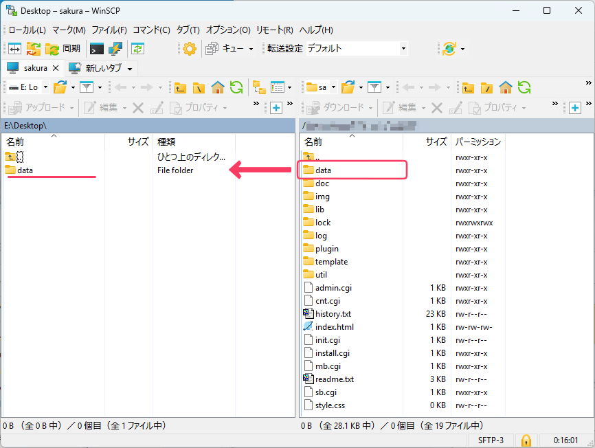

### 1-3. 中身を確認する

ダウンロードした `data` フォルダを開くと、たくさんのファイル・フォルダが入っています。移行でよく使う主なものは次のとおりです。

- `configure.cgi` … ブログの設定（**旧 URL からの転送に必要。必ず含めてください**）
- `entry/` … 記事の本体
- `message/` … コメント
- `category.cgi` … カテゴリー
- `template/` … テンプレート（デザイン）

> ℹ️ **これ以外のファイル（`trackback/`・`user/`・`amazon.cgi`・`link.cgi` など）も入っていますが、選り分ける必要はありません。** `data` フォルダを丸ごと渡せば、取り込みに必要なものだけが自動的に使われます。どのファイルが何で、移行されるのかどうかは、[付録：data フォルダの中のファイルについて](#付録data-フォルダの中のファイルについて) に一覧があります。

> ⚠️ **`configure.cgi` は必ず含めてください。**
> 昔の記事の URL（例：`http://あなたのブログ/blog/log/eid42.html`）を新しい URL へ自動転送する機能は、この `configure.cgi` に書かれた設定を読み取って動きます。これが無いと、古いリンクからの転送が正しく働かないことがあります。

**図3｜ダウンロードした `data` フォルダの中身**

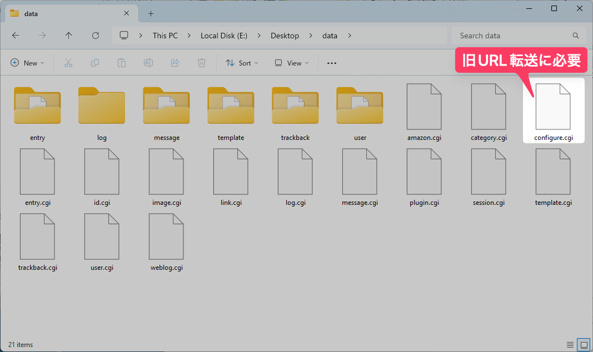

---

## ステップ2｜新しい Serene Bach を手に入れる

### 2-1. 実行ファイルをダウンロードする

新しい Serene Bach は、配布ページから **自分のパソコンに合った実行ファイル** をダウンロードするだけで使えます。Go や Perl などを別に入れる必要はありません。

配布ページ（GitHub のリリースページ）を開き、次の目安で選びます。

| あなたの環境 | 選ぶファイルの目安 |
| --- | --- |
| Windows（ふつうのパソコン） | 名前に `windows` と `amd64` が付いたもの（`.zip`） |
| Mac（Apple シリコン：M1 以降） | 名前に `darwin` と `arm64` が付いたもの |
| Mac（Intel の古い機種） | 名前に `darwin` と `amd64` が付いたもの |

ダウンロードした圧縮ファイルを展開すると、`serenebach`（Windows では `serenebach.exe`）という実行ファイルが出てきます。これは **取り込みとローカル確認（ステップ4〜6）** を作業用パソコンで行うためのものです。

> ⚠️ **レンタルサーバで公開する予定の方は、「サーバ用」のバイナリも必要です。**
> [ステップ7](#ステップ7本番のサーバへ公開する) で本番サーバに置くときは、**サーバの OS に合ったバイナリ**が要ります。作業用パソコンの `.exe`（Windows）などは、サーバではそのまま動きません。いま一緒にダウンロードしておくとスムーズです。
>
> | 公開先サーバの例 | 選ぶファイルの目安 |
> | --- | --- |
> | さくらのレンタルサーバ | 名前に `freebsd` と `amd64`（[動作環境](https://help.sakura.ad.jp/rs/2251/)） |
> | エックスサーバー / ロリポップ など | 多くは `linux` と `amd64`（契約プランの仕様を確認） |
>
> サーバの OS・CPU が分からないときは、契約しているレンタルサーバのヘルプで「FreeBSD / Linux」「64bit（amd64 / x86_64）」を確認してください。

**図4｜配布ページで自分の OS 向けファイルを選ぶ**

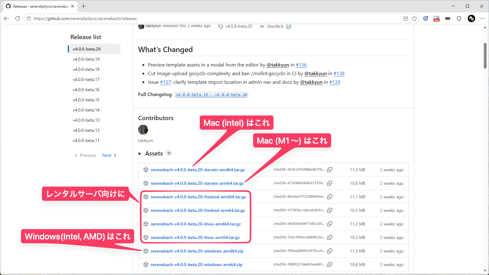

### 2-2. 実行できるようにする（OS で少し違います）

インターネットからダウンロードした実行ファイルは、OS が念のため実行をためらいます。扱いは OS で異なります。

- **Windows**：`serenebach.exe` を初めてダブルクリックすると「WindowsによってPCが保護されました」と出ることがあります。**詳細情報 → 実行** を押せば起動できます（図5・左）。以降はふつうにダブルクリックで起動できます。
- **macOS**：最近の macOS（26 など）は、ダウンロードした未署名のプログラムを **ダブルクリックでは実行できません**。ダブルクリックすると「"serenebach" は開けません」という警告が出て、選べるのは **完了（Done）** か **ゴミ箱に入れる（Move to Bin）** だけです（図5・右）。
    - ⚠️ **「ゴミ箱に入れる」は押さないでください**（実行ファイルが消えます）。**完了（Done）** を押して閉じます。
    - macOS では、この後の手順で **ターミナルから起動**します。ターミナルで展開して実行すればこの警告は出ないので、**この警告を解除する操作は不要**です。

**図5｜Windows と macOS の警告（Windows は「実行」で進める／macOS はダブルクリックでは進めない）**

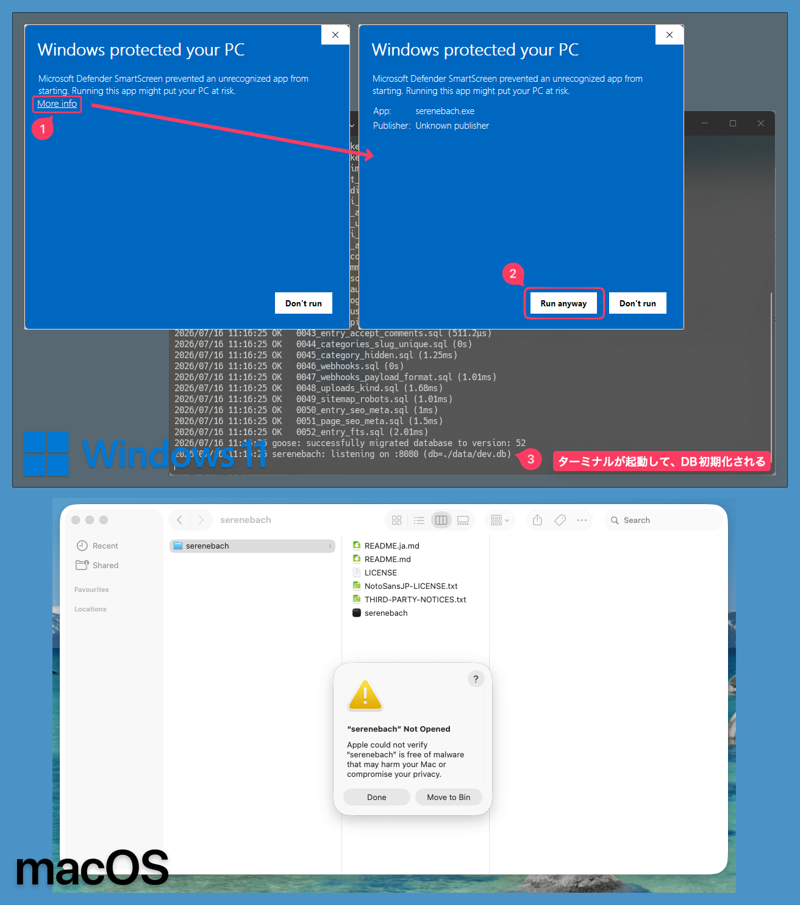

---

## ステップ3｜作業用のフォルダを整える

取り込み作業をしやすくするため、**1つの作業フォルダ** に、実行ファイルとダウンロードしたデータを並べます。

1. デスクトップなどに、作業フォルダを1つ作ります（例：`serenebach-hikkoshi`）。
2. その中に、ステップ2でダウンロードしたものを入れます。
   - **Windows**：`.zip` を展開して出てきた `serenebach.exe` を入れます。
   - **macOS**：**展開せず**、ダウンロードした `.tar.gz` をそのまま入れます（展開はステップ4でターミナルから行います。Finder でダブルクリック展開すると、後で警告が出て実行できなくなることがあります）。
3. さらにその中に、ステップ1でダウンロードした **`data` フォルダ** を入れ、**名前を `sb2data` に変更** します。

> ⚠️ **フォルダ名は必ず `sb2data` に変えてください。**
> 新しい Serene Bach は、自分の作業結果を入れるために `data` という名前のフォルダを自動で作ります。元のブログのフォルダも `data` のままだと名前がぶつかって紛らわしくなります。元データ側は `sb2data` にしておくと安全です。

作業フォルダの中は、最終的にこうなります。

```text
serenebach-hikkoshi/
├── serenebach          （または serenebach.exe）
└── sb2data/            （元のブログの data フォルダをリネームしたもの）
    ├── configure.cgi
    ├── entry/
    ├── message/
    ├── category.cgi
    └── template/
```

> 💡 専用フォルダを作らず、**デスクトップに直接** 実行ファイルと `sb2data` を置いてもかまいません（このガイドのスクリーンショットはその例です）。どちらでも同じように動きます。大事なのは、実行ファイルと `sb2data` が**同じ場所にある**ことです。

**図6｜作業フォルダの構成**

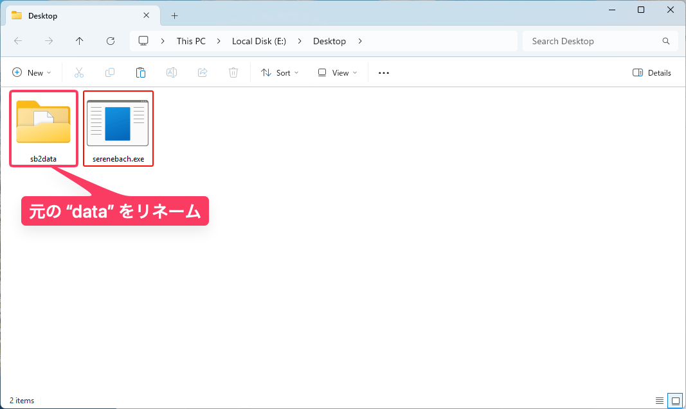

---

## ステップ4｜管理者アカウントを作る

データを取り込む前に、新しい Serene Bach に **管理者アカウント** を1つ作っておきます。ここはブラウザだけで完結します。

### 4-1. いったんプログラムを起動する

起動のしかたは OS で違います。

**Windows の場合**：作業フォルダの `serenebach.exe` を**ダブルクリック**します（初回は前の [2-2](#2-2-実行できるようにするos-で少し違います) のとおり「詳細情報 → 実行」）。黒い画面（ターミナル）が開きます。

**macOS の場合**：作業フォルダで**ターミナルを開き**（開き方は [5-1](#5-1-作業フォルダでターミナルを開く)）、次の2行を順に実行します。1 行目で展開、2 行目で起動です。

```bash
# ① 展開（Apple シリコンの例。Intel Mac は darwin-arm64 を darwin-amd64 に）
tar xzf serenebach-*-darwin-arm64.tar.gz --strip-components=1
# ② 起動
./serenebach
```

> 💡 ファイル名は **Tab キー** で補完できます。`tar` で展開した実行ファイルには [2-2](#2-2-実行できるようにするos-で少し違います) の警告が付かないので、そのまま実行できます。

どちらの場合も、次のような行が表示されれば起動しています。

```text
listening on :8080
```

### 4-2. ブラウザで初期設定を開く

ブラウザで次のアドレスを開きます。

```text
http://localhost:8080/
```

まだ管理者がいないため、自動的に **初期設定（/setup）** の画面に移ります。画面の案内にそって、

- 管理者の **ログイン名** と **パスワード** を決めて入力し、
- **「サンプル記事を投入する」のチェックを外す**（オフにする）

を行い、作成します。

> 💡 **サンプル記事は入れないでください。** あとで自分のブログの記事だけを取り込むので、サンプルが混ざっていると確認しづらくなります。

**図7｜初期設定で管理者を作る（サンプルなし）**

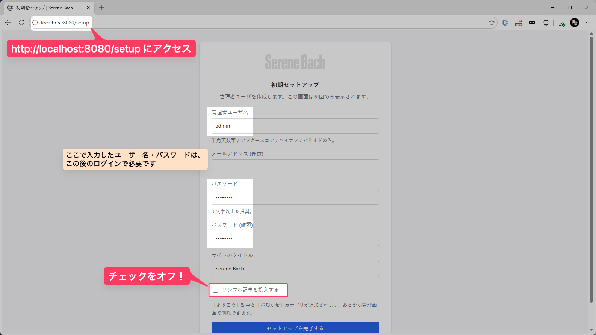

### 4-3. いったん停止する

管理者を作ったら、起動していた黒い画面に戻り、**Ctrl キーを押しながら C** を押してプログラムを止めます（Mac でも `Ctrl` + `C` です）。

これで、作業フォルダの中に `data` フォルダと、その中の新しいデータベースファイル（`dev.db`）ができています。次の取り込みは、このデータベースに対して行います。

---

## ステップ5｜データを取り込む（1回だけのコマンド操作）

いよいよ取り込みです。ここだけ **コマンドを1行** 打ちます。

### 5-1. 作業フォルダで「ターミナル」を開く

まず、作業フォルダの中でターミナル（命令を打つ画面）を開きます。

- **Windows 11**：作業フォルダ内の何もない所を**右クリック** →「**ターミナルで開く**」を選びます。
- **Windows 10**：**Shift キーを押しながら**フォルダ内の何もない所を右クリック →「**PowerShell ウィンドウをここで開く**」を選びます。
- **macOS**：作業フォルダを **右クリック（または control + クリック）** →「**フォルダに新規ターミナル**」を選びます。（メニューに出ないときは、「システム設定 → キーボード → ショートカット → サービス」で有効にできます。）

**図8｜作業フォルダでターミナルを開く（Windows / macOS）**

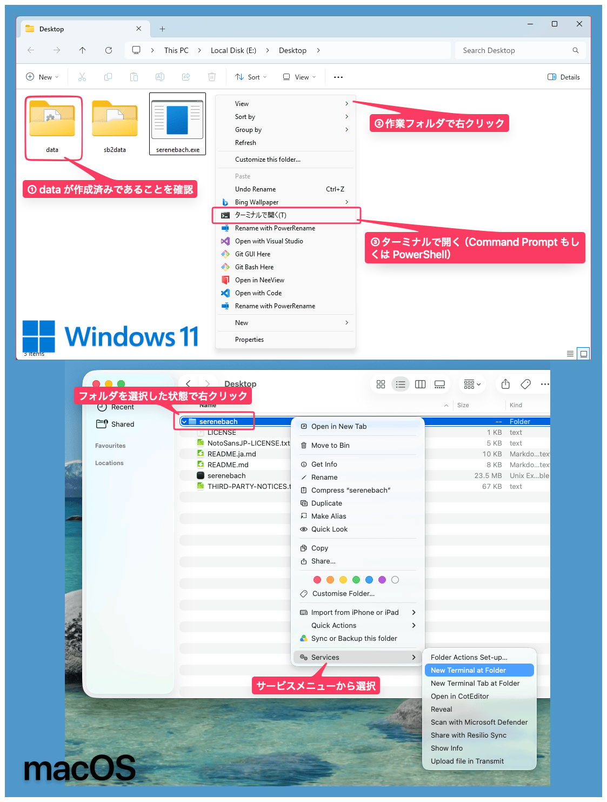

### 5-2. 取り込みコマンドを打つ

開いたターミナルに、下の1行を **そのままコピーして貼り付け**、Enter キーを押します。

**macOS の場合：**

```bash
./serenebach import --sb-version 2 ./sb2data
```

**Windows（PowerShell）の場合：**

```powershell
.\serenebach.exe import --sb-version 2 .\sb2data
```

> 💡 `--sb-version 2` は「Serene Bach **2** から取り込む」という意味です。この指定を忘れると新しい形式（SB3）として読もうとして失敗します。

### 5-3. 結果を読む

取り込みが終わると、件数と注意書きが表示されます。たとえば、このガイドに付属する[サンプルブログ](samples/sb2-migration/README.md)（個人情報を含まない架空のデータ）を取り込むと、次のように出ます（**あなたのブログでは件数は変わります**）。

```text
import: weblog updated=true, templates=2, categories=5, entries=10, skipped=2
import: warning: template "標準テンプレート": block {trackback} not supported by Go port (trackback feature is out of scope)
```

読み方は次のとおりです。

- `entries=10` … **10件の記事** が取り込まれました。
- `skipped=2` … **2件は取り込まれませんでした**。これはどちらも下書き（未公開）の記事です。公開済みの記事だけが取り込まれる仕様なので、正常な動きです。
- `categories=5` … カテゴリーが5件。
- `templates=2` … テンプレートが2件。
- `warning:` の行 … テンプレートの中に、新しい Serene Bach では使えないタグ（この例では **トラックバック**）が含まれていたという **お知らせ** です。エラーではありません。公開前にテンプレートを見直す目印になります。

> 💡 コメント（このサンプルでは10件）も一緒に取り込まれますが、件数は表示されません。トラックバックは取り込まれない（対象外）ので、件数にも警告にも出てきません。

**図9｜取り込み後のターミナル表示**

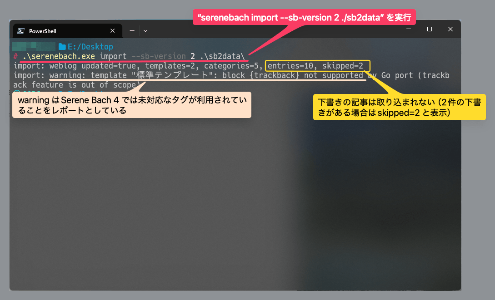

> ❗ もし `SB2 data directory not found` のようなエラーが出たら、フォルダ名が `sb2data` になっているか、ターミナルを **作業フォルダの中** で開いているかを確認してください。→ [困ったときは](#困ったときは)

---

## ステップ6｜パソコンの中で結果を確認する

公開する前に、パソコンの中で表示を確かめます。ここは本番サーバには一切影響しません。

### 6-1. もう一度プログラムを起動する

実行ファイルをもう一度起動します（**Windows**：`serenebach.exe` をダブルクリック。**macOS**：ターミナルで `./serenebach`。展開はもう済んでいるので、起動だけで大丈夫です）。起動したら、ブラウザで次を開きます。

```text
http://localhost:8080/
```

### 6-2. 管理画面で件数を確かめる

ブラウザで管理画面にログインします。

```text
http://localhost:8080/admin/login
```

ステップ4で決めたログイン名・パスワードで入り、**記事一覧** を開いて、記事の件数が元ブログの公開記事数と合っているかを確認します。

**図10｜管理画面の記事一覧で件数を確認**

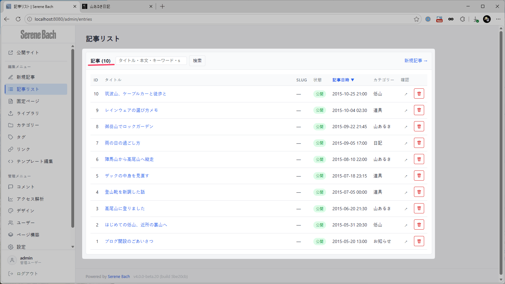

### 6-3. 公開ページを見る

管理画面ではなく、読者が見る側のページも確認します。

- トップページ：`http://localhost:8080/`
- 記事ページ・カテゴリーページ・月別アーカイブ

**図11｜公開トップページ**

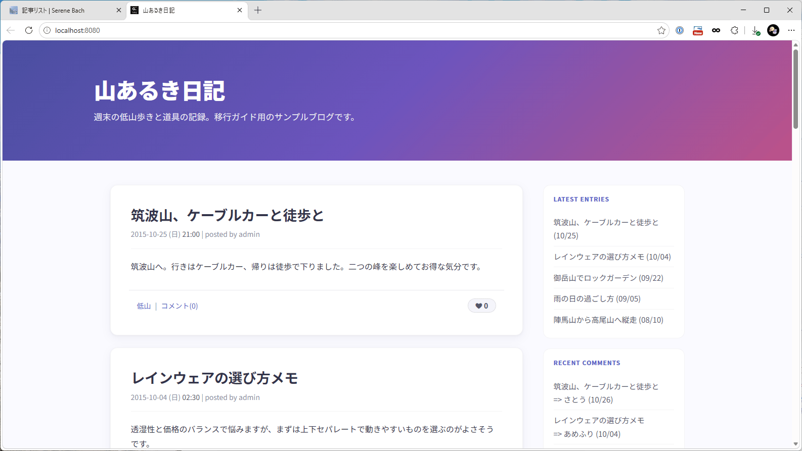

### 6-4. コメントを確かめる

管理画面の **コメント** を開くと、取り込まれたコメントが並びます。承認待ちのコメントは「承認待ち」の状態で入っています。

**図12｜コメント画面（承認待ちを含む）**

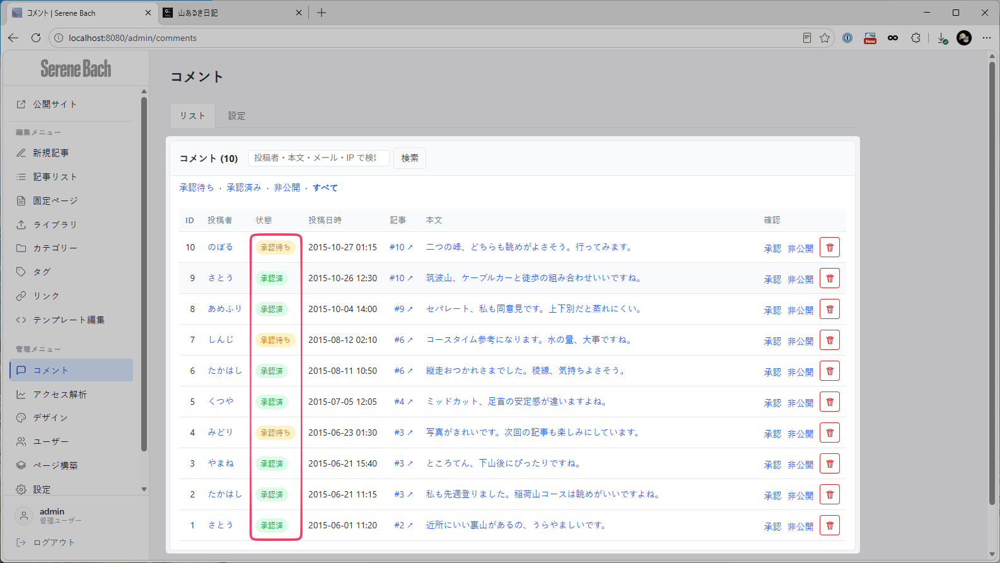

### 6-5. テンプレート（デザイン）を確かめて切り替える

取り込んだテンプレートは、**すぐには使われません**（安全のため）。管理画面のデザイン／テンプレートの画面で内容を確認し、問題なければ **利用中に切り替え** ます。ステップ5で出た警告（未対応タグ）があれば、この画面で該当箇所を直します。

**図13｜取り込んだテンプレートの確認と切り替え**

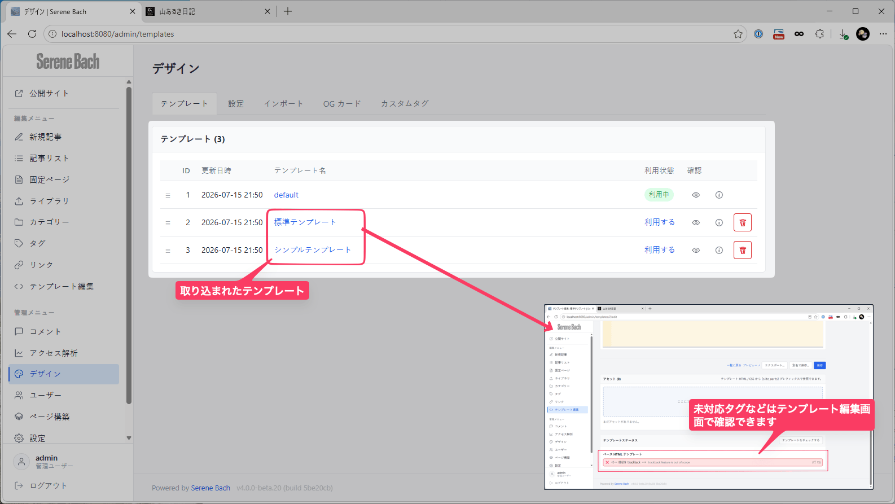

### 6-6. 画像が表示されないのは想定どおり

記事の中の画像は、この**ローカル確認の時点では表示されません**。作業用パソコンの中には画像ファイルが無いためで、不具合ではありません。本番サーバ（今と同じサーバ）では画像がすでにあるので、公開後はそのまま表示されます（別のサーバへ移す場合だけ、ステップ7で画像をコピーします）。

**図14｜画像が表示されないのは想定どおり**

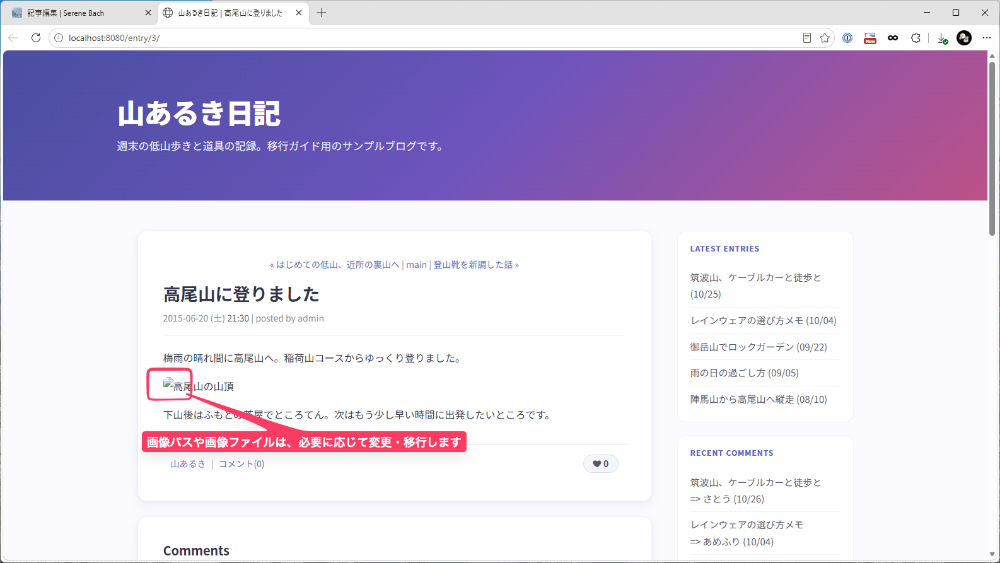

---

## ステップ7｜本番のサーバへ公開する

パソコンの中で表示を確認できたら、いよいよ公開します。

### 前提：多くの場合は「今と同じサーバ」で入れ替えます

いま Serene Bach 2 を動かしているレンタルサーバは、そのまま新しい Serene Bach の設置先にできます。**別のサーバへ引っ越す必要は必ずしもありません。** このガイドは「**今と同じサーバで、Perl 版を新しい Serene Bach（1つの実行ファイル）に置き換える**」流れを中心に説明します（別サーバへ移す場合の違いは末尾に補足します）。

同じサーバで入れ替える利点：

- 記事内の**画像はすでにサーバ上にある**ので、そのまま表示されます（運び直し不要）。
- ブログの URL（ドメイン・パス）が変わらないので、昔のリンクの転送も素直に効きます。

### 用意するもの（同じサーバで入れ替える場合）

FTP で次をサーバへ置きます。

1. **サーバ用のバイナリ** … [ステップ2-1](#ステップ2新しい-serene-bach-を手に入れる) でダウンロードした**サーバの OS 向け**のもの。⚠️ 作業用パソコンの `serenebach.exe`（Windows）などは**サーバでは動きません**。CGI で動かす場合は `serenebach.cgi` にリネームし、実行権限（パーミッション 755）を付けるのが一般的です。
2. **データベース** `data/dev.db` … 取り込んだ記事・コメントが入っています（作業フォルダの `data` の中）。
3. **`.htaccess`** … 「このプログラムを CGI として実行し、ブログの URL をこれに渡す」ようサーバへ指示する設定ファイル。

> 🖼️ **画像は運ばなくて大丈夫。** 同じサーバなら、記事が参照している画像（`img/` など）はすでにその場所にあるので、そのまま表示されます。**別サーバへ移すときだけ**、画像フォルダも FTP でコピーします。

### CGI として動かす（レンタルサーバ）

新しい Serene Bach は、**1つの実行ファイルを CGI として置くだけ**で動きます（Perl 版のように多数のファイルを設置する必要はありません）。おおまかな流れは次のとおりです。

1. サーバ用バイナリを FTP でアップロードし、`serenebach.cgi` にリネーム、実行権限（755）を付ける。
2. 取り込んだ `data/dev.db` を、そのすぐそばの `data/` に置く。
3. `.htaccess` で、ブログの URL を `serenebach.cgi` に渡す（管理画面の表示を速くする `extract-assets` の設定も入れられます）。
4. ブラウザでブログを開く。**取り込み済みの DB を運ぶので管理者はすでに作成済み**です。管理画面は `/admin/login` から入れます。

手順の詳細（`serenebach.cgi` へのリネーム・パーミッション・`.htaccess` の書き方・`extract-assets`・サーバ別メモ）は、非技術者向けの **[レンタルサーバで公開するガイド（CGI）](cgi-deploy.ja.md)** にまとめています。まずはそちらを参照してください（さらに技術的な確定情報は [deployment.md の CGI 節](../deployment.md)）。

> ⚠️ この方法は「自分で用意したバイナリを CGI として実行できる」レンタルサーバでのみ使えます。**さくらのレンタルサーバは実行できます。** エックスサーバー / ロリポップなどは、独自バイナリの CGI 実行が許可されているか各社のヘルプで確認してください（[公開ガイドの該当節](cgi-deploy.ja.md#この方法が使えるサーバ最初に確認)）。

### 常駐サーバで動かす場合（VPS など）

プログラムを動かし続けられる VPS などでは、CGI ではなく常駐サーバとして動かせます。詳しくは [deployment.md（HTTP server）](../deployment.md) を参照してください。

### 昔のリンクが新しい URL へ転送されるか確認する

公開できたら、**昔の記事の URL** をブラウザで開いてみて、新しい URL へ自動で移動するかを確認します。この転送は、パソコンでの確認時（`localhost`）と**サーバ上とで同じように動きます**。ただしサーバでは、昔の `.html` や `sb.cgi?...` の URL が Serene Bach に届くよう、前述の `.htaccess` で振り分けておく必要があります。

このガイドのサンプルブログ（`https://example.com/blog/` に設置されていたと仮定）では、次のように転送されます。

| 昔の URL | 転送先 |
| --- | --- |
| `https://example.com/blog/sb.cgi?eid=2` | その記事の新しいページ |
| `https://example.com/blog/log/eid2.html` | 同じ記事の新しいページ |
| `https://example.com/blog/hiking/` | 「山あるき」カテゴリーの新しいページ |

**図15｜昔の URL が新しい URL へ転送される**

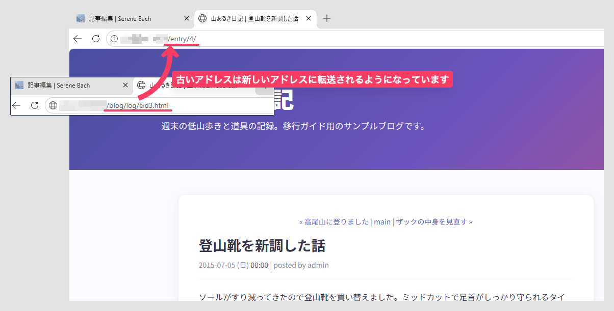

### 別のサーバへ移す場合

今と違うサーバへ移すときは、同じサーバでの入れ替えに加えて次に注意してください。

- **画像フォルダも運ぶ**：新しいサーバには画像がないので、元ブログの `img/` などを FTP でコピーします。
- **URL が変わると転送は完全には効かない**：ドメインやパスが変わると、昔のリンクをそのまま維持できないことがあります。重要なページは移行後に実際の URL を開いて確認してください。

---

## 移行後のチェックリスト

公開後、次の点を確認しておくと安心です。

- [ ] 記事の件数が、元ブログの公開記事数と合っている
- [ ] トップページ・記事ページ・カテゴリーページ・アーカイブが正しく開ける
- [ ] コメントが表示され、承認待ちの扱いが適切になっている
- [ ] テンプレートを確認し、未対応タグの警告があれば直してから利用中に切り替えた
- [ ] 記事内の画像が表示される（同じサーバならそのまま／別サーバなら画像コピー後）
- [ ] 昔の記事 URL から新しい URL へ転送される
- [ ] コメントの受け付け設定・ブログの URL・SNS 共有カード（OG カード）の設定を見直した
- [ ] 必要な利用者アカウントを新しく作り直した

---

## 困ったときは

| 症状 | 確認すること |
| --- | --- |
| 取り込みで `SB2 data directory not found` と出る | フォルダ名が `sb2data` になっているか。ターミナルを **作業フォルダの中** で開いているか。コマンドの末尾のフォルダ指定（`./sb2data`）が合っているか。 |
| `no admin user`（管理者がいない）と出る | 先に [ステップ4](#ステップ4管理者アカウントを作る) の管理者作成を済ませたか。取り込みと同じ作業フォルダで起動しているか（データベースの場所がずれると管理者が見つかりません）。 |
| 文字が化けて表示される | 通常は自動で文字コードを判別して直します。もし化ける記事があれば、その記事を管理画面で開いて確認してください。元データが特殊な文字コードで保存されていた可能性があります。 |
| 記事の件数が合わない | 下書き（未公開）の記事は取り込まれません（`skipped` の件数）。それを差し引いて公開記事数と合っていれば正常です。 |
| macOS で「開けません／ゴミ箱に入れる」と出る | 最近の macOS はダウンロードした未署名プログラムを**ダブルクリックでは実行できません**。**ターミナルから** [4-1 の macOS 手順](#4-1-いったんプログラムを起動する)（`tar` で展開して `./serenebach`）で起動してください。それでも「開けません」と出る場合（Finder で展開して隔離属性が付いた等）は、ターミナルで `xattr -d com.apple.quarantine serenebach` を一度実行するか、**システム設定 → プライバシーとセキュリティ →「このまま開く」** で許可します。 |
| Windows で警告が出て実行できない | 「詳細情報 → 実行」を押してください。 |
| 画像が表示されない | 今と同じサーバなら、元からある画像がそのまま使われます。別のサーバへ移した場合は、[ステップ7](#ステップ7本番のサーバへ公開する) の手順で画像フォルダをコピーしてください（取り込み自体は画像ファイルを扱いません）。 |

より技術的な内容（文字コード判別の詳しい仕組み、URL 転送の対応範囲など）は、[SB2 / SB3 からの移行と機能差異](../help/ja/15-sb3-migration.md)（管理画面のヘルプにも同じ内容が入っています）と、[importing-legacy-sb.md](../importing-legacy-sb.md) を参照してください。

---

## 付録：data フォルダの中のファイルについて

`data` フォルダには、記事やコメント以外にもたくさんのファイルが入っています。**移行にあたって、これらを自分で選り分ける必要はありません。** `data` フォルダを丸ごと取り込みに使えば、必要なものだけが自動的に読み込まれます。

「自分の `data` にこんなファイルがあるけど大丈夫？」と気になったときのために、主なファイルの意味と、移行されるかどうかを一覧にしておきます。

| ファイル / フォルダ | 内容 | 移行される？ |
| --- | --- | --- |
| `entry/` ＋ `entry.cgi` | 記事の本体と索引 | ✅ 公開記事のみ |
| `message/` ＋ `message.cgi` | コメントの本体と索引 | ✅ |
| `category.cgi` | カテゴリー | ✅ |
| `template/` ＋ `template.cgi` | テンプレート（デザイン） | ✅ 無効状態で取り込み、確認後に切り替え |
| `weblog.cgi` | ブログのタイトル・説明 | ✅ |
| `configure.cgi` | 管理設定（URL など） | ✅ 旧 URL 転送の設定として使われる |
| `trackback/` ＋ `trackback.cgi` | トラックバック | ❌ 新 Serene Bach は非対応 |
| `user/` ＋ `user.cgi` | 利用者アカウント | ❌ 新しく作り直します |
| `link.cgi` | リンク集（ブログロール） | ❌ 管理画面で作り直します |
| `image.cgi` | 画像の登録情報 | ❌ 画像ファイルは手動でコピー |
| `plugin.cgi` | プラグイン設定 | ❌ Perl プラグインは動きません |
| `amazon.cgi` | Amazon 連携データ | ❌ 非対応 |
| `id.cgi` / `session.cgi` / `log.cgi` / `log/` | 内部管理用（ID 採番・ログインセッション・アクセスログ） | ❌ 使いません |

> ℹ️ **`init.cgi` について**：URL の形式（記事ファイル名のルールなど）の設定は `init.cgi` にありますが、これは `data` フォルダの中ではなく、`sb.cgi` と同じ場所（CGI の設置フォルダ）にあります。標準的な設定（`eid42.html` の形式）であれば、`configure.cgi` だけで旧 URL の転送は働きます。URL 形式を変更していた場合のみ、`init.cgi` も同じフォルダにコピーしておくと転送の精度が上がります。

上の表に載っていないファイル（プラグインが作るキャッシュなど）が `data` フォルダにあっても、取り込みには影響しません。そのまま丸ごと渡して大丈夫です。

これらのファイルがどう扱われるかは、実際に取り込んで確認できる[サンプルブログ](samples/sb2-migration/README.md)（このガイド付属・個人情報なし）でも確かめられます。

---

## 上級者向けの近道（付録）

以下は、コマンド操作になじみのある方向けの補足です。**必須ではありません。**

### サーバに SSH でログインできる方

パソコンにダウンロードせず、**サーバ上で直接** 取り込む方法もあります。実行ファイルをサーバにアップロードし、SSH でログインして、サーバ上の Serene Bach 2 の `data` ディレクトリを直接指定して取り込みます。

```bash
# サーバ上で（管理者を作成後）
./serenebach import --sb-version 2 /path/to/sb2/data
```

FTP でのダウンロード・アップロードの往復が不要になります。

### Windows で WSL が使える方

WSL（Windows 上の Linux 環境）が使える場合は、Linux 版の実行ファイルを使って、macOS / Linux と同じコマンドで作業できます。ターミナル操作に慣れている方には、こちらのほうが手軽なことがあります。

### Linux デスクトップの方

Linux デスクトップをお使いの方は、Linux 版の実行ファイルをダウンロードすれば、本ガイドの macOS 向けコマンド（`./serenebach ...`）がそのまま使えます。手順の考え方は同じです。

### 開発者向けの取り込み方法

Go の開発環境と `task`（go-task）が入っている場合は、開発用のショートカットも使えます。詳細は [importing-legacy-sb.md](../importing-legacy-sb.md) を参照してください。

```bash
task import -- --sb-version 2 /path/to/sb2/data
```

---

## 関連ドキュメント

- [ガイド一覧](README.md)
- [SB2 / SB3 からの移行と機能差異（ヘルプ）](../help/ja/15-sb3-migration.md)
- [importing-legacy-sb.md（技術リファレンス）](../importing-legacy-sb.md)
- [deployment.md（公開・デプロイ）](../deployment.md)
- [スクリーンショット撮影指示書](sb2-migration-screenshots.md)
- [サンプル SB2 ブログ（このガイド用）](samples/sb2-migration/README.md)
